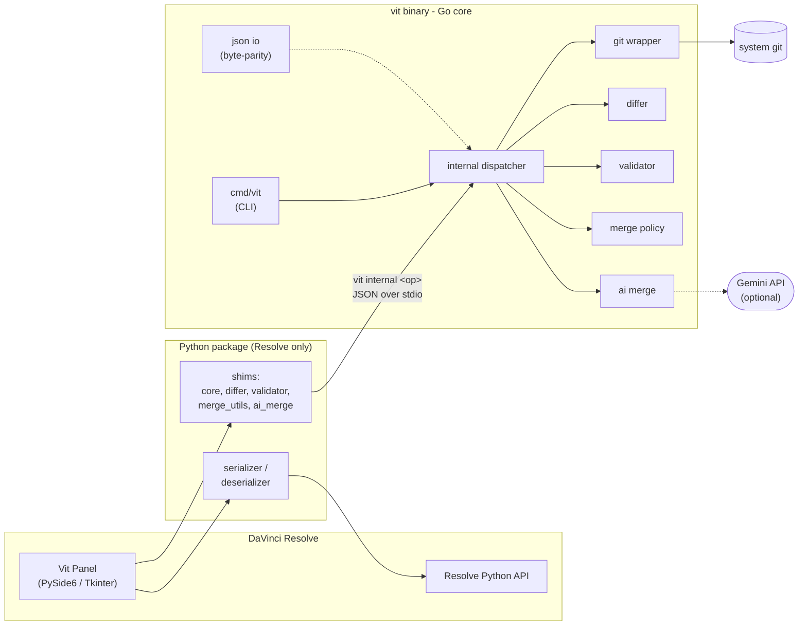

# Vit: Git for Video Editing

Vit brings git-style version control to video editing. Instead of versioning raw
media files, Vit tracks **timeline metadata** (clip placements, color grades,
audio levels, effects, and markers) as lightweight JSON, using Git as the
backend.

Collaborators (editors, colorists, sound designers) work in parallel on branches
and merge changes cleanly, the same way developers do with code.

The core insight: version control the edit *decisions*, not the gigabytes of
media. A timeline becomes a set of small, diffable JSON files that Git can branch
and merge, and the media stays on disk untouched.

---

## Architecture

Vit has one source of truth for all logic: a dependency-free Go binary. The
DaVinci Resolve plugin stays in Python (Resolve's scripting API is Python-only)
but delegates every git, diff, merge, and validation operation to the Go binary
over a small JSON protocol.



Both entry points, the panel and the command line, resolve to the same Go core
and the same real Git repository. Whichever side writes a JSON file, the bytes
are identical (two-space indent, sorted keys, escaped non-ASCII, preserved float
literals), so Git diffs never churn on formatting.

For the full design, data model, algorithms, and rationale, see the
[**deep dive**](docs/DEEP_DIVE.md).

---

## How It Works

The timeline is serialized into **domain-split JSON**, so different roles touch
different files and merge without stepping on each other:

| File | Holds | Owner |
|------|-------|-------|
| `cuts.json` | Clip placements, in/out points, transforms, speed | Editor |
| `color.json` | Color grades per clip | Colorist |
| `audio.json` | Levels, panning | Sound designer |
| `effects.json` | Effects, transitions | Editor / VFX |
| `markers.json` | Markers, notes | Anyone |
| `metadata.json` | Frame rate, resolution, track counts | Rarely |

Because an editor edits `cuts.json` and a colorist edits `color.json`, Git merges
their work automatically. When a merge produces a cross-domain issue that plain
Git cannot see (for example, a clip deleted on one branch but color-graded on
another), Vit runs a post-merge validation pass and, optionally, an AI-assisted
semantic merge.

---

## Features

- Branch-and-merge workflow for a real editing timeline.
- Domain-split JSON that keeps role-based work conflict-free.
- Human-readable diffs (`+ Added clip 'B-Roll.mov' on V2 at 00:00:10:00`).
- Overlay-aware merge resolution for title and media id collisions.
- Post-merge validation for orphaned references, overlaps, and sync drift.
- Optional AI (Gemini) for semantic merges, commit messages, and log summaries.
- A single Go binary with no third-party dependencies.

---

## Installation

**Requirements:** Go 1.25+, Git, Python 3.8+ (only for the Resolve plugin),
DaVinci Resolve (optional).

```bash
# 1. Get the source
git clone https://github.com/raptor7197/vit.git
cd vit

# 2. Build the CLI binary
go build -o ~/.vit/bin/vit ./cmd/vit

# 3. Add it to your PATH (also append this line to ~/.bashrc or ~/.zshrc)
export PATH="$HOME/.vit/bin:$PATH"
vit --version

# 4. (Resolve users only) install the plugin package and link it into Resolve
pip install .
vit install-resolve
```

---

## Usage

Vit works from the command line today, with or without Resolve. The Resolve panel
is additive: it writes the JSON from a live timeline, then calls the same commands.

**Start a project:**

```bash
vit init my-project && cd my-project
vit collab setup            # connect to an empty GitHub repo (sets push tracking)
```

**Daily loop:**

```bash
vit pull                    # get the team's latest changes
vit checkout my-branch      # restore your branch
# ... edit (in Resolve, the panel writes the JSON on Save Version) ...
vit diff                    # see what changed, in plain English
vit commit -m "rough cut"   # save a version
vit push                    # share it
```

**Branch and merge:**

```bash
vit branch color-grade      # branch per role or experiment
vit checkout color-grade
vit commit -m "first color pass"
vit checkout main
vit merge color-grade       # combine, with validation and optional AI
vit log                     # version history
```

---

## Commands

| Command | Description |
|---------|-------------|
| `vit init` | Initialize a new vit project |
| `vit add` | Serialize timeline and stage changes |
| `vit commit -m "msg"` | Stage and commit |
| `vit branch <name>` | Create a new branch |
| `vit checkout <name>` | Switch branches (restores the timeline in Resolve) |
| `vit merge <branch>` | Merge a branch (with validation and optional AI) |
| `vit diff` | Human-readable timeline diff |
| `vit log` | Formatted version history |
| `vit revert` | Undo the last commit |
| `vit push` / `vit pull` | Sync with a remote |
| `vit status` | Show project status |
| `vit collab setup` | Connect the project to a git remote |
| `vit clone <url>` | Clone a shared vit project |
| `vit install-resolve` | Link the plugin scripts into DaVinci Resolve |

---

## Project Structure

```
cmd/vit/                  CLI entry point (Go)
internal/vit/             Core library (Go)
  git.go                  git operations wrapper
  differ.go               human-readable diff formatting
  validator.go            post-merge validation
  mergeutils.go           overlay-aware merge policy
  aimerge.go              AI semantic merge (Gemini)
  jsonio.go               domain-split JSON I/O (byte-parity with Python)
  internalcmd.go          JSON dispatcher for the Python bridge

vit/                      Python package for the Resolve plugin
  serializer.py           Resolve timeline -> JSON
  deserializer.py         JSON -> Resolve timeline
  models.py               data models
  json_writer.py          domain-split JSON I/O
  core.py, differ.py, validator.py, merge_utils.py, ai_merge.py
                          thin shims that call the Go binary

resolve_plugin/           DaVinci Resolve integration (panel + scripts)
tests/                    Python tests (serializer, plugin, Go-shim integration)
docs/                     Reference docs, including the deep dive
```

---

## Distribution Note

This repository is a public distribution. The proprietary core, the
merge-conflict resolution engine (`internal/vit/mergeutils.go`), the AI merge
engine (`internal/vit/aimerge.go`), and the validation engine
(`internal/vit/validator.go`), ships here as **interface-preserving stubs**.

The project builds, installs, and runs end to end, and the entire architecture,
CLI, JSON layer, differ, and Python bridge are the real implementation. Only the
three engines above are withheld. In the stub build, validation reports no
issues, overlay merges pass the input through unchanged, and AI features return
their no-key fallbacks. The full implementation is available under NDA.

---

## Testing

```bash
go test ./...             # core library (git, differ, JSON parity, and more)
python -m pytest tests/   # serializer, deserializer, plugin, Go-shim integration
```

The Python tests need the `vit` binary on your PATH, or set `VIT_BINARY` to its
path.

---

## License

MIT
